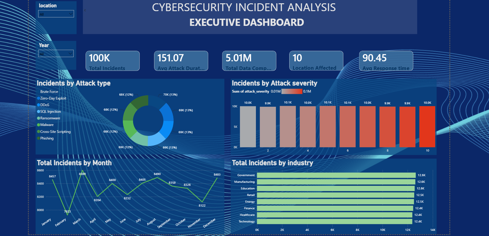

# Cybersecurity Incident Analysis Dashboard Using Power BI
A Power BI project that visualizes cybersecurity incident data with interactive dashboards, KPIs, attack analysis, and threat intelligence insights.
# Executive Dashboard

# Threat Intelligence Dashboard

powerbi
power-query
dax
cybersecurity
data-analytics
business-intelligence
dashboard
data-visualization
threat-intelligence
soc
